<div align="center">

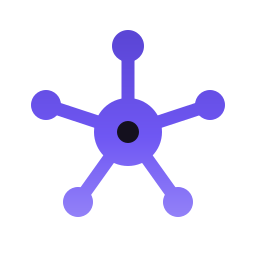

# Нервион

**Открытая система управления проектами и задачами для команд и агентств.**

Self-hosted или облако. Канбан и задачи, тайм-трекинг и планирование загрузки, чат и звонки, база знаний, встроенная почта, свой git и медиатека живут в одном приложении. Российская замена Jira, YouTrack и зоопарка сервисов.

[](./LICENSE)
[](https://nestjs.com)
[](https://nuxt.com)
[](https://www.typescriptlang.org)
[](https://www.postgresql.org)

[🚀 Живое демо](https://preprod.app.nervion.ru/try?utm_source=github&utm_medium=readme) · [Сайт](https://nervion.ru) · [Документация](./docs) · [Лицензирование](./LICENSING.md)

</div>

---

## 🚀 Живое демо

Попробуйте Нервион прямо сейчас, без регистрации: **[открыть демо](https://preprod.app.nervion.ru/try?utm_source=github&utm_medium=readme)**.

Демо-стенд наполнен реальными примерами: проекты с канбан-досками, задачи по колонкам, тайм-трекинг и отчёты, планирование загрузки, личные и групповые чаты, база знаний, встроенная почта с папками, свой git-репозиторий с ветками и уведомления. Заходите под демо-аккаунтом одним кликом и щёлкайте по разделам.

## Что это

Нервион это open-source трекер для команд, которые устали платить за десяток разных сервисов и хотят держать данные у себя. Канбан и задачи, учёт времени, планирование загрузки людей, общение и база знаний работают в одной системе и в одном интерфейсе.

Подходит как полноценное импортозамещение Jira, YouTrack, Trello, Redmine для российских команд: разворачивается на вашем сервере (данные не уходят наружу) или берётся как managed-облако.

## Возможности

- 🗂 **Задачи и проекты** — канбан и список, приоритеты, сторипоинты, дедлайны, подзадачи, связи между задачами, спринты, гибкие фильтры и сохранённые представления.
- ⏱ **Тайм-трекинг** — таймеры со стартом и паузой, ручной учёт часов, статусы записей, привязка к задачам.
- 📊 **Планирование загрузки** — недельные аллокации «план/факт» по сотрудникам и проектам: видно, кто чем занят и где перегруз.
- 📈 **Отчёты** — сводки по времени и задачам в разрезе проектов и людей, выгрузка в XLSX.
- 💬 **Чат и звонки** — реалтайм-чаты (личные и групповые, с вложениями и голосовыми), голосовые и видео-комнаты на каждый проект с демонстрацией экрана (WebRTC / mediasoup).
- 📚 **База знаний (вики)** — дерево страниц с бесконечной вложенностью, богатый редактор (TipTap): заголовки, списки, таблицы, цитаты, блоки кода, картинки, чек-листы.
- 📨 **Встроенная почта** — приём и отправка писем, несколько ящиков, папки (входящие, отправленные, черновики, корзина), привязка писем к задачам через адреса вида task+ID@.
- 🌿 **Свой git-хостинг** — репозитории внутри трекера: ветки, коммиты, диффы, дерево файлов и просмотр кода, привязка к проектам.
- 🎬 **Медиатека** — командные видео и фото для проектов.
- 🔔 **Уведомления** — web-push, оповещения об упоминаниях, назначениях и дедлайнах.
- 🛡 **Контроль и надёжность** — роли и права доступа, журнал аудита действий, health-чеки и мониторинг внешних сервисов.
- 📘 **Документированный API** — полное описание OpenAPI / Swagger из коробки (`/api/docs`).
- 🏠 **Self-hosted и облако** — полный контроль над данными на своём сервере или managed-вариант под ключ.

## Скриншоты

| Канбан-доска | Карточка задачи |
| --- | --- |
| 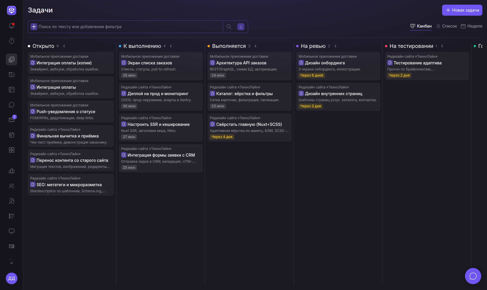 | 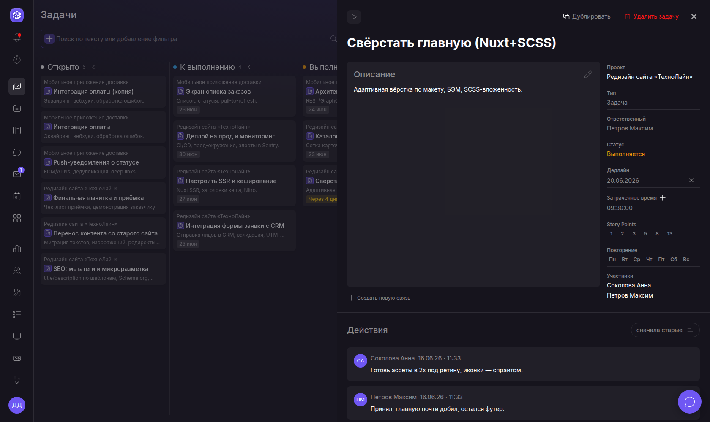 |

| Планирование загрузки | Графики работы |
| --- | --- |
| 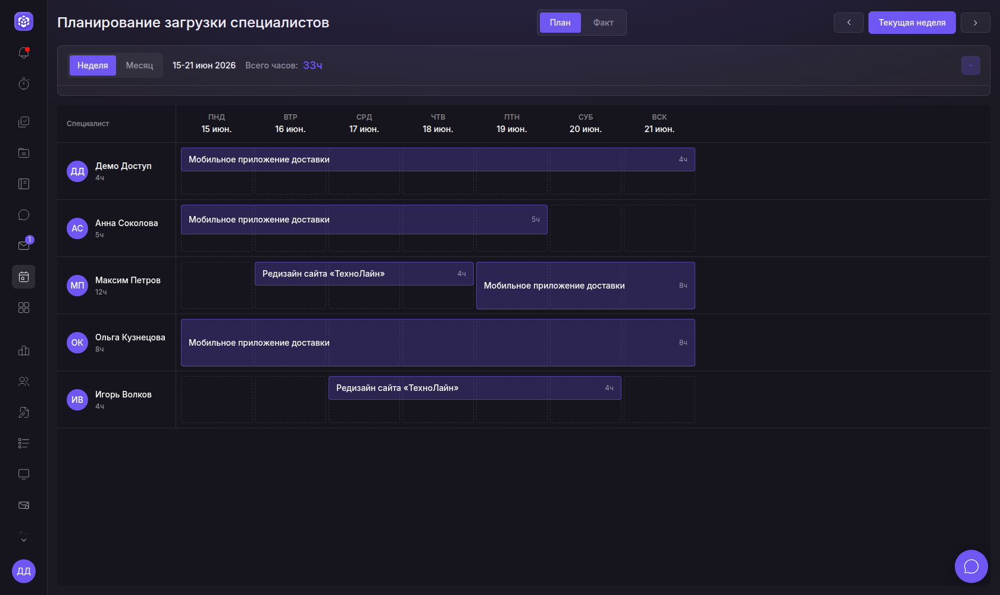 | 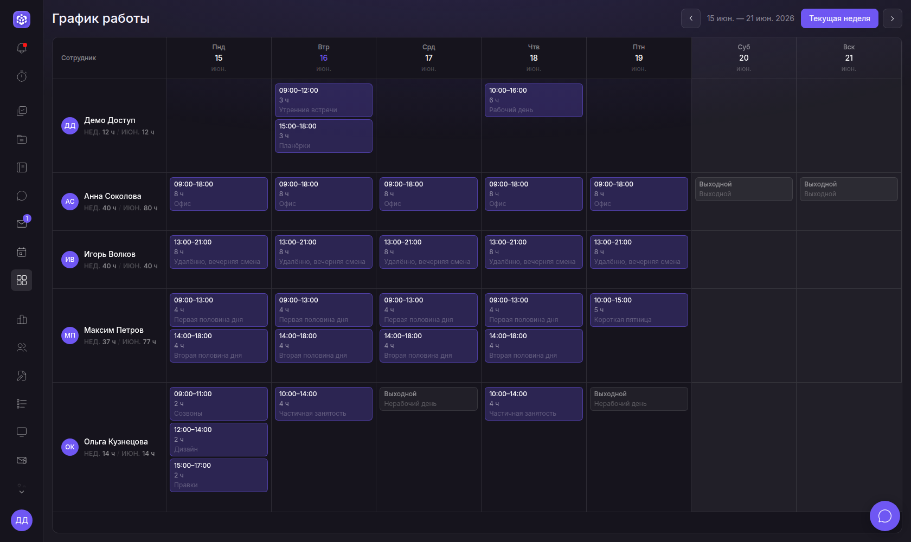 |

| Чат | База знаний |
| --- | --- |
| 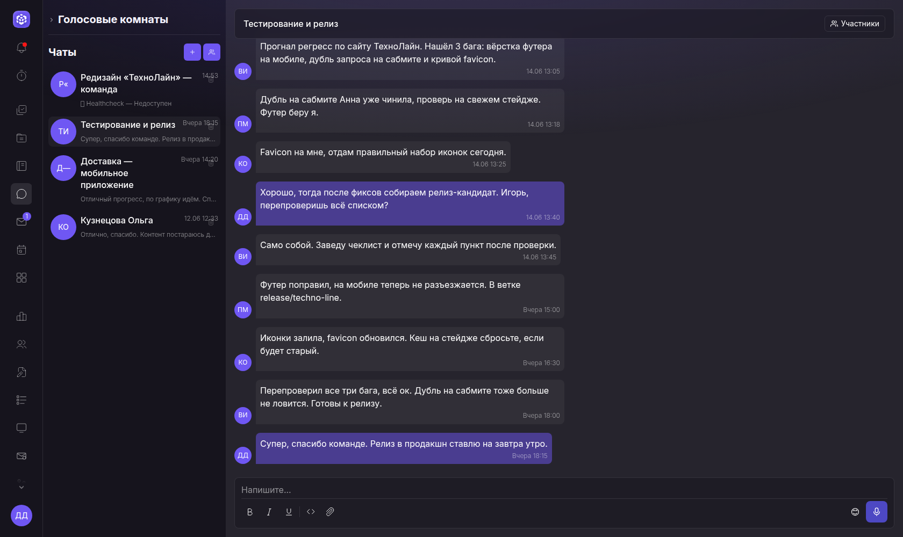 | 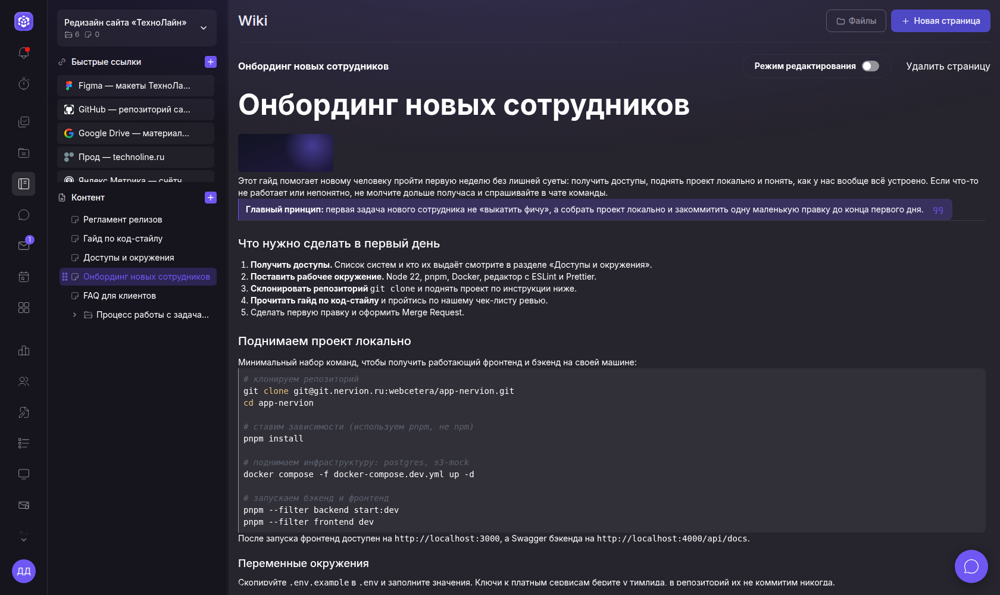 |

| Встроенная почта | Свой git-хостинг |
| --- | --- |
| 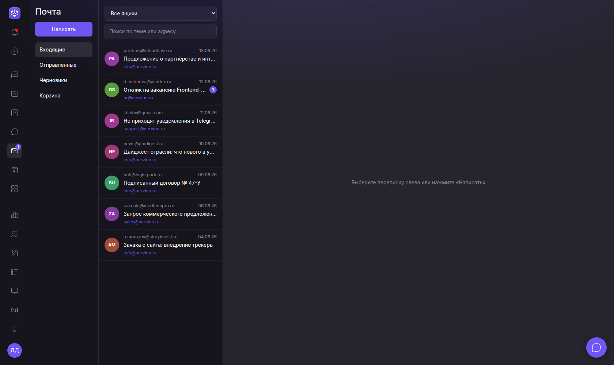 | 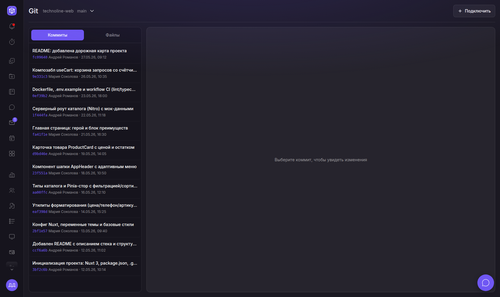 |

| Мониторинг сервисов | Журнал изменений |
| --- | --- |
| 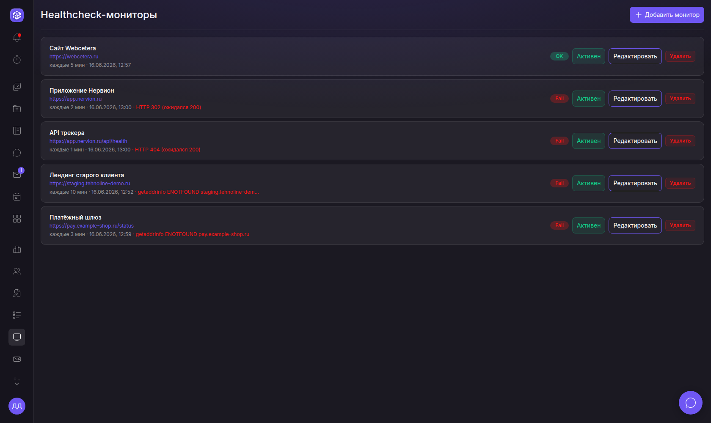 | 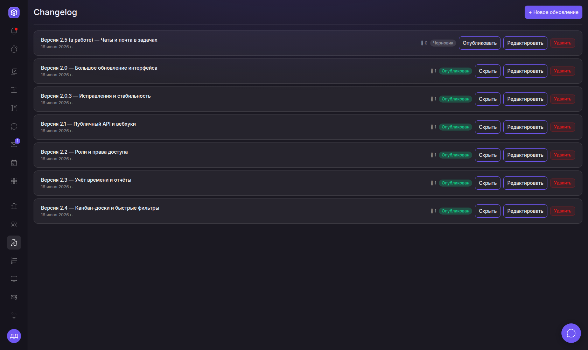 |

## Кому подходит

- **Студиям и агентствам** — проекты клиентов, загрузка команды, учёт часов и рентабельность, общение по проекту в одном месте.
- **Продуктовым командам** — канбан и спринты, база знаний, обсуждения и созвоны без переключения между сервисами.
- **Распределённым командам** — реалтайм-чаты и голосовые комнаты на проект с демонстрацией экрана, push-уведомления, всё с минимальной задержкой.
- **Компаниям с требованиями к данным** — self-hosted на своём сервере, данные не покидают периметр.

## Почему Нервион

- **Один инструмент вместо десятка.** Задачи, время, планирование, чат, звонки, вики, почта и git не размазаны по внешним сервисам, а живут вместе.
- **Данные у вас.** Self-hosted разворачивается на вашем железе. Никакой привязки к чужому облаку.
- **Импортозамещение.** Рабочая российская замена Jira, YouTrack, Trello, Confluence без валютных платежей и риска отключения.
- **Без лимита пользователей** на self-hosted: open-source под AGPLv3 бесплатна для любой команды.
- **Открытый код.** Можно аудировать, дорабатывать под себя и контрибьютить.

## Технологии

Монорепозиторий на pnpm + turbo.

- **Backend:** NestJS, TypeORM, PostgreSQL, WebRTC (mediasoup), WebSockets.
- **Frontend:** Nuxt 3 (Vue 3), Pinia, TipTap, SCSS.
- **Инфраструктура:** Docker / Docker Compose, S3-совместимое хранилище, OpenAPI / Swagger.

## Быстрый старт (Docker)

Полный комплект (PostgreSQL + API + веб-приложение) одной командой:

```bash
cp apps/backend/.env.example apps/backend/.env   # работает из коробки, секреты заполнять не обязательно
docker compose up --build
```

Откройте http://localhost:3000 — фронтенд, API на http://localhost:3026, документация API на http://localhost:3026/api/docs. Чистая БД создаётся штатной initial migration, последующие миграции накатываются при старте. Секрет подписи токенов генерируется сам, отдельно настраивать его не нужно.

## Запуск без Docker

```bash
pnpm i
cp apps/backend/.env.example apps/backend/.env
cp apps/frontend/.env.example apps/frontend/.env
# заполнить .env, поднять PostgreSQL, затем:
pnpm --filter backend dev
pnpm --filter frontend dev
```

Для production без Docker собирайте приложения и запускайте
`apps/backend/dist/main.js` и `apps/frontend/.output/server/index.mjs`. Nuxt SSR
может обращаться к локальному backend через
`NUXT_API_INTERNAL_URL=http://127.0.0.1:3026`, а браузер — через публичный
`NUXT_PUBLIC_API_URL`. Backend также нужен исполняемый mediasoup-worker,
указанный абсолютным путём в `MEDIASOUP_WORKER_BIN`.

Подробнее — в [`docs/development.md`](./docs/development.md).

## API и документация

Весь API описан через OpenAPI / Swagger. После запуска интерактивная документация доступна по адресу `/api/docs` (например `http://localhost:3026/api/docs`), машинное описание — `/api/docs-json`. Авторизация поддерживается как по cookie-сессии, так и по API-токену для внешних интеграций.

## Структура

- `apps/backend` — API (NestJS + TypeORM, PostgreSQL)
- `apps/frontend` — веб-приложение (Nuxt 3 / Vue)
- `packages/contracts` — общие типы и контракты backend ↔ frontend

## Конфигурация

Вся конфигурация через переменные окружения, у каждого приложения свой файл с документированным образцом:

- backend: [`apps/backend/.env.example`](./apps/backend/.env.example) — БД, S3, почта и прочее
- frontend: [`apps/frontend/.env.example`](./apps/frontend/.env.example) — публичные настройки (URL API, S3-endpoint)

Секреты (помечены `[secret]`) не коммитятся: реальные `.env` в `.gitignore`, в репозитории только `.env.example`.

## Дорожная карта

Проект активно развивается. В планах: расширение интеграций, мобильные клиенты, гибкие автоматизации и шаблоны процессов. Предложения и голосование за фичи — через [issues](https://github.com/ar-webcetera/nervion/issues).

## Внедрение под ключ

Не хотите разворачивать и поддерживать сами? Команда Webcetera поставит и настроит Нервион на вашем сервере, перенесёт данные из Jira или другого трекера, сделает интеграции и возьмёт сопровождение (или managed-облако).

- Сайт: https://webcetera.ru
- Telegram: https://t.me/webcetera
- Почта: info@webcetera.ru · по лицензии: license@webcetera.ru
- Телефон: +7 999 194-81-21

## Лицензия

Open-core: исходный код под **AGPLv3** ([`LICENSE`](./LICENSE)). Доступна отдельная **коммерческая** лицензия для закрытых продуктов и SaaS без copyleft-обязательств — см. [`LICENSING.md`](./LICENSING.md).

## Контрибьюторам

Конвенции и архитектурные правила — в [`AGENTS.md`](./AGENTS.md). Вклад принимается на условиях [`CLA.md`](./CLA.md) (подписывается в один клик при первом PR). Баг-репорты и идеи — в [issues](https://github.com/ar-webcetera/nervion/issues).

## FAQ

**Это правда бесплатно?** Да, self-hosted-версия под AGPLv3 бесплатна и без лимита на число пользователей. Платная только опциональная коммерческая лицензия (для закрытых продуктов) и внедрение под ключ.

**Можно держать данные только у себя?** Да, это основной сценарий: разворачиваете на своём сервере, данные не уходят наружу.

**Это замена Jira?** Да, Нервион закрывает типовые сценарии Jira, YouTrack, Trello и Confluence в одном приложении, плюс чат, звонки, почту и git.

**Какая нужна инфраструктура?** Docker и PostgreSQL. Для голосовых и видео-комнат используется WebRTC (mediasoup), для файлов и медиа — S3-совместимое хранилище.

**Есть API?** Да, полностью документированный REST API с OpenAPI / Swagger и поддержкой API-токенов.
